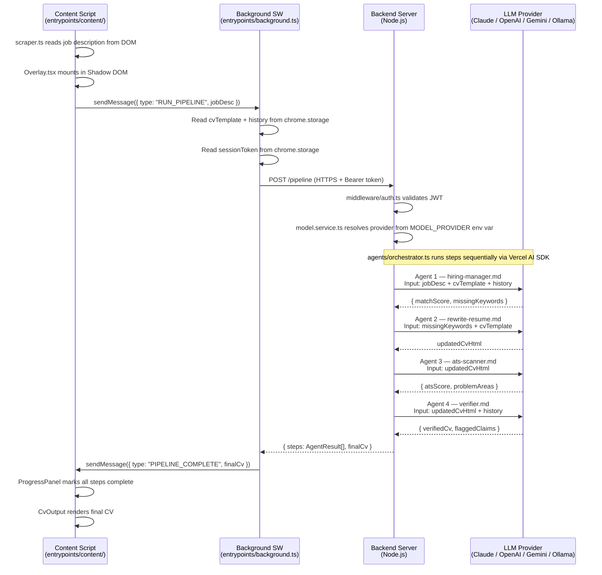

# CV Fitter Chrome Extension — High-Level Project Structure

> Generated from: `project-overview.md`, `wxt-anthropic-rules.md`, `wxt-react-rules.md`

---

## Monorepo Layout

```
resume-fitter/
├── extension/          # WXT browser extension (Chrome MV3)
├── server/             # Node.js backend (holds API key, runs 4-agent pipeline)
└── .claude/            # Project docs, agents, rules, skills
```

---

## Extension (WXT + React + TypeScript)

```
extension/
├── wxt.config.ts                    # WXT config: manifest permissions, host_permissions,
│                                    # Shadow DOM entrypoint, CSP settings
├── package.json                     # Pinned deps (no ^ on critical packages per rules)
├── tsconfig.json                    # strict: true
│
├── entrypoints/                     # WXT entrypoints only — kept thin, delegate to services
│   │
│   ├── background.ts                # Background Service Worker
│   │                                # • Listens for messages from content script
│   │                                # • Reads CV template + history from chrome.storage
│   │                                # • fetch() → POST /pipeline on backend server
│   │                                # • Streams progress events back to content script
│   │                                # • Handles all Anthropic-related errors (never calls SDK directly)
│   │
│   └── content/                     # Content Script (runs on job posting pages)
│       ├── index.tsx                # Entry: injects Shadow DOM host, mounts React overlay
│       ├── scraper.ts               # Reads job description from LinkedIn / Greenhouse /
│       │                            # Glassdoor DOM — returns plain text
│       └── overlay/                 # Injected React UI (isolated in Shadow DOM)
│           ├── Overlay.tsx          # Root component — owns pipeline state
│           ├── ProgressPanel.tsx    # Shows step-by-step agent progress (1/4 → 4/4)
│           ├── CvOutput.tsx         # Renders final CV HTML when pipeline completes
│           ├── ErrorBanner.tsx      # Surfaces pipeline / API errors to user
│           └── hooks/
│               ├── usePipeline.ts   # Drives 4-step pipeline via sendMessage to background
│               └── useStorage.ts    # Reads CV template + professional history from storage
│
├── components/                      # Shared presentational UI components
│   ├── Button.tsx
│   ├── Spinner.tsx
│   └── Badge.tsx                    # e.g. "ATS Score: 87"
│
├── services/                        # Business logic classes (one responsibility each)
│   └── storage.service.ts           # StorageService — typed wrappers around
│                                    # storage.defineItem<T>() for CV template + history
│
├── constants/
│   └── agents.ts                    # Agent step labels, status strings used in UI
│
├── types/
│   ├── pipeline.ts                  # PipelineStep, PipelineState, AgentResult
│   ├── messages.ts                  # Typed WXT message payloads (RunPipeline, ProgressUpdate,
│   │                                # PipelineComplete, PipelineError)
│   └── cv.ts                        # CvTemplate, HistoryEntry shapes
│
├── utils/
│   ├── scraper-utils.ts             # DOM parsing helpers (strip scripts, truncate to 100k chars)
│   └── validation.ts                # Zod schemas for backend response validation
│
└── public/
    └── icons/                       # Extension icons (16, 48, 128px)
```

### Manifest Permissions (wxt.config.ts)

```ts
manifest: {
  permissions: ["storage", "activeTab", "scripting"],
  host_permissions: [
    "https://*.linkedin.com/*",
    "https://*.greenhouse.io/*",
    "https://*.glassdoor.com/*",
    "https://*.lever.co/*",
    "https://*.workday.com/*",
    "https://*/*",                        // fallback: any company career page
    "https://your-backend-domain.com/*"   // backend server only
  ]
  // NOT https://api.anthropic.com/* — API key never leaves server
}
```

### chrome.storage.local Items

| Key | Type | Description |
|---|---|---|
| `local:cvTemplate` | `string` (HTML) | User's base CV template |
| `local:professionalHistory` | `string` (Markdown) | Full professional history |
| `local:sessionToken` | `string` | Short-lived JWT for backend auth |

---

## Backend Server (Node.js + TypeScript)

### Key Dependencies

| Package | Purpose |
|---|---|
| `ai` | Vercel AI SDK core (`generateText`, `streamText`) |
| `@ai-sdk/anthropic` | Claude provider |
| `@ai-sdk/openai` | OpenAI provider |
| `@ai-sdk/google` | Gemini provider |
| `@ai-sdk/ollama` | Local models via Ollama |

```
server/
├── package.json
├── tsconfig.json
├── .env                             # MODEL_PROVIDER=anthropic        ← never committed
│                                    # ANTHROPIC_API_KEY=sk-ant-...
│                                    # OPENAI_API_KEY=sk-...           (optional)
│                                    # GOOGLE_GENERATIVE_AI_API_KEY=.. (optional)
│                                    # OLLAMA_BASE_URL=http://localhost:11434 (local models)
│                                    # MODEL_NAME=claude-sonnet-4-6    (overrides default)
│                                    # SESSION_SECRET=...
│                                    # PORT=3001
│
└── src/
    ├── index.ts                     # Express entry point — mounts routes, starts server
    │
    ├── middleware/
    │   ├── auth.ts                  # Validates session token (JWT) from extension
    │   └── rateLimit.ts             # Per-token rate limiting
    │
    ├── routes/
    │   └── pipeline.ts              # POST /pipeline
    │                                # Body: { jobDescription, cvTemplate, history }
    │                                # Returns: { steps: AgentResult[], finalCv: string }
    │
    ├── agents/                      # Each agent = one isolated Claude API call
    │   ├── orchestrator.ts          # Runs agents 1→2→3→4 sequentially,
    │   │                            # passes only necessary context to each
    │   ├── hiring-manager.ts        # Agent 1: job desc × CV → match score + keywords
    │   ├── rewrite-resume.ts        # Agent 2: keywords × CV → rewritten CV HTML
    │   ├── ats-scanner.ts           # Agent 3: new CV → ATS score + problem areas
    │   └── verifier.ts              # Agent 4: new CV × history → flagged claims
    │
    ├── prompts/                     # System prompts as plain Markdown files
    │   ├── hiring-manager.md        # Prompt for Agent 1
    │   ├── rewrite-resume.md        # Prompt for Agent 2
    │   ├── ats-scanner.md           # Prompt for Agent 3
    │   └── verifier.md              # Prompt for Agent 4
    │
    ├── services/
    │   └── model.service.ts         # ModelService class (Vercel AI SDK)
    │                                # • Resolves provider from MODEL_PROVIDER env var
    │                                #   e.g. "anthropic" | "openai" | "google" | "ollama"
    │                                # • complete(systemPrompt, userPrompt): Promise<string>
    │                                # • Uses generateText() from 'ai' package
    │                                # • Handles APICallError, NoSuchModelError, retries
    │
    └── types/
        └── pipeline.types.ts        # AgentResult, PipelineRequest, PipelineResponse
```

---

## Data Flow Diagram



---

## Key Architectural Rules (from project rules)

| Rule | Where enforced |
|---|---|
| API key **never** in browser | Only in `server/.env` → `ModelService` |
| Vercel AI SDK called **only** on server | `model.service.ts` — never in extension code |
| Provider swappable via env var | `MODEL_PROVIDER` + `MODEL_NAME` in `server/.env` |
| Max **300 lines per file** | All modules in `services/`, `agents/` |
| **Zod** validates all LLM responses | `extension/utils/validation.ts` |
| **Shadow DOM** isolates overlay CSS | `content/index.tsx` host element |
| **Split context** per agent | Each agent call is a fresh API request |
| State persisted in `chrome.storage`, not SW memory | `StorageService` + `storage.defineItem<T>()` |
| `browser.*` not `chrome.*` in extension code | All extension entrypoints/hooks |
